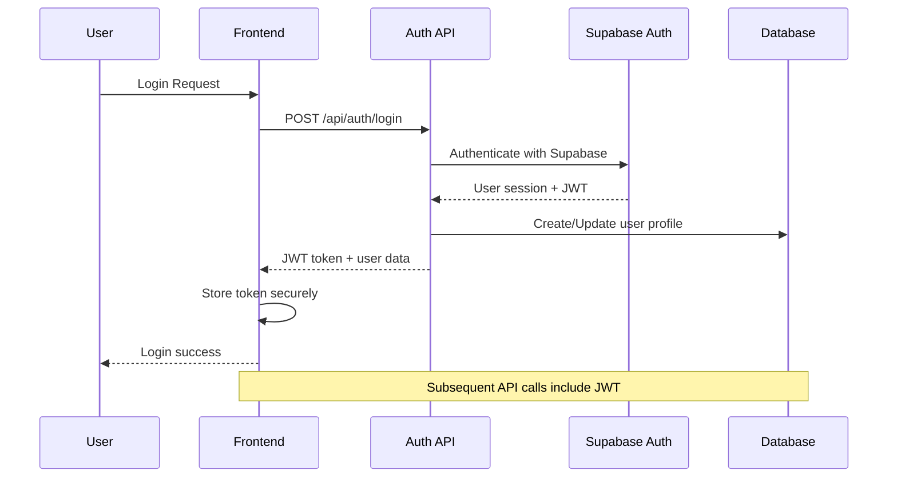

# Authentication Architecture

## Overview

ForSure implements a comprehensive authentication system using Supabase Auth as the primary authentication provider, supplemented with JWT tokens for API security. The architecture supports multiple authentication methods, role-based access control, and secure session management.

## Authentication Flow



## Authentication Methods

### 1. Email/Password Authentication

```typescript
// Primary authentication method
const loginWithEmailPassword = async (email: string, password: string) => {
  const { data, error } = await supabase.auth.signInWithPassword({
    email,
    password,
  })

  if (error) throw error

  return {
    user: data.user,
    session: data.session,
    accessToken: data.session?.access_token,
  }
}
```

### 2. Social Authentication

```typescript
// Supported providers: Google, GitHub, Discord
const loginWithProvider = async (provider: 'google' | 'github' | 'discord') => {
  const { data, error } = await supabase.auth.signInWithOAuth({
    provider,
    options: {
      redirectTo: `${window.location.origin}/auth/callback`,
    },
  })

  if (error) throw error
  return data
}
```

### 3. Magic Link Authentication

```typescript
// Passwordless email authentication
const sendMagicLink = async (email: string) => {
  const { error } = await supabase.auth.signInWithOtp({
    email,
    options: {
      emailRedirectTo: `${window.location.origin}/auth/callback`,
    },
  })

  if (error) throw error
}
```

## Session Management

### JWT Token Structure

```typescript
interface JWTPayload {
  aud: string // Audience
  exp: number // Expiration time
  sub: string // User ID
  email: string // User email
  role: string // User role
  app_metadata: {
    provider?: string
    [key: string]: any
  }
  user_metadata: {
    name?: string
    [key: string]: any
  }
}
```

### Token Refresh Strategy

```typescript
// lib/auth.ts
export const refreshSession = async (): Promise<boolean> => {
  try {
    const { data, error } = await supabase.auth.refreshSession()

    if (error) throw error

    if (data.session) {
      // Update stored tokens
      localStorage.setItem('access_token', data.session.access_token)
      return true
    }

    return false
  } catch (error) {
    console.error('Session refresh failed:', error)
    return false
  }
}
```

### Session Persistence

```typescript
// Auth context with session persistence
export const AuthProvider: React.FC<{ children: React.ReactNode }> = ({ children }) => {
  const [user, setUser] = useState<User | null>(null)
  const [loading, setLoading] = useState(true)

  useEffect(() => {
    // Initialize auth state
    const initializeAuth = async () => {
      try {
        const { data: { session } } = await supabase.auth.getSession()

        if (session?.user) {
          const userProfile = await getUserProfile(session.user.id)
          setUser(userProfile)
        }
      } catch (error) {
        console.error('Auth initialization failed:', error)
      } finally {
        setLoading(false)
      }
    }

    initializeAuth()

    // Listen for auth changes
    const { data: { subscription } } = supabase.auth.onAuthStateChange(
      async (event, session) => {
        if (session?.user) {
          const userProfile = await getUserProfile(session.user.id)
          setUser(userProfile)
        } else {
          setUser(null)
        }
        setLoading(false)
      }
    )

    return () => subscription.unsubscribe()
  }, [])

  return (
    <AuthContext.Provider value={{ user, loading, login, logout, register }}>
      {children}
    </AuthContext.Provider>
  )
}
```

## Role-Based Access Control (RBAC)

### Role Definitions

```typescript
export enum UserRole {
  USER = 'user',
  ADMIN = 'admin',
  MODERATOR = 'moderator',
}

export interface Permission {
  resource: string
  actions: ('create' | 'read' | 'update' | 'delete')[]
}

export const rolePermissions: Record<UserRole, Permission[]> = {
  [UserRole.USER]: [
    { resource: 'own_profile', actions: ['read', 'update'] },
    {
      resource: 'own_projects',
      actions: ['create', 'read', 'update', 'delete'],
    },
    { resource: 'public_content', actions: ['read'] },
  ],
  [UserRole.MODERATOR]: [
    { resource: 'own_profile', actions: ['read', 'update'] },
    {
      resource: 'own_projects',
      actions: ['create', 'read', 'update', 'delete'],
    },
    { resource: 'public_content', actions: ['read', 'update'] },
    { resource: 'comments', actions: ['read', 'update', 'delete'] },
  ],
  [UserRole.ADMIN]: [
    { resource: '*', actions: ['create', 'read', 'update', 'delete'] },
  ],
}
```

### Permission Checking Middleware

```typescript
// lib/rbac.ts
export const hasPermission = (
  userRole: UserRole,
  resource: string,
  action: string
): boolean => {
  const permissions = rolePermissions[userRole]

  return permissions.some(permission => {
    const hasResourceAccess =
      permission.resource === resource || permission.resource === '*'
    const hasActionAccess = permission.actions.includes(action as any)

    return hasResourceAccess && hasActionAccess
  })
}

export const withRBAC = (
  requiredRole: UserRole,
  resource: string,
  action: string
) => {
  return (handler: Function) => {
    return async (request: NextRequest, context: any) => {
      const user = context.user

      if (!user) {
        return Response.json({ error: 'Unauthorized' }, { status: 401 })
      }

      if (!hasPermission(user.role, resource, action)) {
        return Response.json({ error: 'Forbidden' }, { status: 403 })
      }

      return handler(request, context)
    }
  }
}
```

### Frontend Route Protection

```typescript
// components/ProtectedRoute.tsx
interface ProtectedRouteProps {
  children: React.ReactNode
  requiredRole?: UserRole
  fallback?: React.ReactNode
}

export const ProtectedRoute: React.FC<ProtectedRouteProps> = ({
  children,
  requiredRole = UserRole.USER,
  fallback = <div>Access denied</div>
}) => {
  const { user, loading } = useAuth()

  if (loading) {
    return <div>Loading...</div>
  }

  if (!user) {
    return <Navigate to="/login" replace />
  }

  if (!hasPermission(user.role, 'route', 'access')) {
    return fallback
  }

  return <>{children}</>
}
```

## API Authentication

### Authentication Middleware

```typescript
// lib/auth-middleware.ts
export const withAuth = (handler: Function) => {
  return async (request: NextRequest, context: any) => {
    try {
      const authHeader = request.headers.get('Authorization')

      if (!authHeader || !authHeader.startsWith('Bearer ')) {
        return Response.json(
          { error: 'Missing authorization header' },
          { status: 401 }
        )
      }

      const token = authHeader.substring(7)

      // Verify JWT with Supabase
      const {
        data: { user },
        error,
      } = await supabase.auth.getUser(token)

      if (error || !user) {
        return Response.json(
          { error: 'Invalid or expired token' },
          { status: 401 }
        )
      }

      // Get user profile with role
      const userProfile = await getUserProfile(user.id)

      return handler(request, { ...context, user: userProfile })
    } catch (error) {
      console.error('Authentication error:', error)
      return Response.json({ error: 'Authentication failed' }, { status: 401 })
    }
  }
}
```

### API Route Examples

```typescript
// app/api/users/profile/route.ts
export const GET = withAuth(
  async (request: NextRequest, { user }: { user: User }) => {
    try {
      // User can only access their own profile
      const { data, error } = await supabase
        .from('users')
        .select('*')
        .eq('id', user.id)
        .single()

      if (error) throw error

      return apiResponse(data)
    } catch (error) {
      return apiError('Failed to fetch profile', 500)
    }
  }
)

export const PUT = withAuth(
  async (request: NextRequest, { user }: { user: User }) => {
    try {
      const body = await request.json()
      const validatedData = updateProfileSchema.parse(body)

      // Users can only update their own profile
      const { data, error } = await supabase
        .from('users')
        .update(validatedData)
        .eq('id', user.id)
        .select()
        .single()

      if (error) throw error

      return apiResponse(data)
    } catch (error) {
      if (error instanceof z.ZodError) {
        return apiError('Validation failed', 422, error.errors)
      }
      return apiError('Failed to update profile', 500)
    }
  }
)
```

## Security Best Practices

### Password Security

```typescript
// Password validation with Zod
const passwordSchema = z
  .string()
  .min(8, 'Password must be at least 8 characters')
  .regex(/^(?=.*[a-z])/, 'Must contain at least one lowercase letter')
  .regex(/^(?=.*[A-Z])/, 'Must contain at least one uppercase letter')
  .regex(/^(?=.*\d)/, 'Must contain at least one number')
  .regex(/^(?=.*[@$!%*?&])/, 'Must contain at least one special character')

// Password strength indicator
const calculatePasswordStrength = (password: string): number => {
  let strength = 0

  if (password.length >= 8) strength += 1
  if (password.length >= 12) strength += 1
  if (/[a-z]/.test(password)) strength += 1
  if (/[A-Z]/.test(password)) strength += 1
  if (/\d/.test(password)) strength += 1
  if (/[@$!%*?&]/.test(password)) strength += 1

  return Math.min(strength, 5)
}
```

### Session Security

```typescript
// Secure session configuration
export const sessionConfig = {
  maxAge: 60 * 60 * 24 * 7, // 7 days
  httpOnly: true,
  secure: process.env.NODE_ENV === 'production',
  sameSite: 'strict' as const,
  path: '/',
}

// Token validation
export const validateToken = (token: string): boolean => {
  try {
    // Check token format
    if (!token || typeof token !== 'string') return false

    // Decode and check expiration
    const decoded = jwt.decode(token) as any
    if (!decoded || !decoded.exp) return false

    const isExpired = Date.now() >= decoded.exp * 1000
    return !isExpired
  } catch {
    return false
  }
}
```

### Rate Limiting for Auth

```typescript
// Enhanced rate limiting for auth endpoints
export const authRateLimit = rateLimit({
  // Login attempts: 5 per 15 minutes
  '/api/auth/login': { limit: 5, window: 15 * 60 * 1000 },

  // Registration: 3 per hour
  '/api/auth/register': { limit: 3, window: 60 * 60 * 1000 },

  // Password reset: 3 per hour
  '/api/auth/reset-password': { limit: 3, window: 60 * 60 * 1000 },

  // General API: 100 per 15 minutes
  default: { limit: 100, window: 15 * 60 * 1000 },
})
```

## Password Reset Flow

### Reset Request

```typescript
export const requestPasswordReset = async (email: string) => {
  try {
    const { error } = await supabase.auth.resetPasswordForEmail(email, {
      redirectTo: `${window.location.origin}/reset-password`,
    })

    if (error) throw error

    return { success: true, message: 'Password reset email sent' }
  } catch (error) {
    return { success: false, error: 'Failed to send reset email' }
  }
}
```

### Reset Confirmation

```typescript
export const confirmPasswordReset = async (
  token: string,
  newPassword: string
) => {
  try {
    const { error } = await supabase.auth.updateUser({
      password: newPassword,
    })

    if (error) throw error

    return { success: true, message: 'Password updated successfully' }
  } catch (error) {
    return { success: false, error: 'Failed to update password' }
  }
}
```

## Multi-Factor Authentication (MFA)

### TOTP Setup

```typescript
export const setupTOTP = async (userId: string) => {
  try {
    const { data, error } = await supabase.auth.mfa.enroll({
      factorType: 'totp',
      friendlyName: 'ForSure App',
    })

    if (error) throw error

    return {
      qrCode: data.qr_code,
      secret: data.secret,
      factorId: data.id,
    }
  } catch (error) {
    throw new Error('Failed to setup MFA')
  }
}
```

### MFA Verification

```typescript
export const verifyMFA = async (factorId: string, code: string) => {
  try {
    const { data, error } = await supabase.auth.mfa.verify({
      factorId,
      challengeId: challengeId, // From previous step
      code,
    })

    if (error) throw error

    return { success: true, accessToken: data.access_token }
  } catch (error) {
    throw new Error('Invalid MFA code')
  }
}
```

## Audit Logging

### Authentication Events

```typescript
export const logAuthEvent = async (
  userId: string,
  event: 'login' | 'logout' | 'register' | 'password_reset',
  metadata?: any
) => {
  try {
    await supabase.from('auth_logs').insert({
      user_id: userId,
      event,
      ip_address: metadata?.ip,
      user_agent: metadata?.userAgent,
      metadata,
      created_at: new Date().toISOString(),
    })
  } catch (error) {
    console.error('Failed to log auth event:', error)
  }
}
```

### Security Monitoring

```typescript
export const detectSuspiciousActivity = async (userId: string) => {
  try {
    // Check for multiple failed login attempts
    const { data: failedAttempts } = await supabase
      .from('auth_logs')
      .select('*')
      .eq('user_id', userId)
      .eq('event', 'login_failed')
      .gte('created_at', new Date(Date.now() - 60 * 60 * 1000).toISOString())

    if (failedAttempts && failedAttempts.length > 5) {
      // Trigger security alert
      await triggerSecurityAlert(userId, 'Multiple failed login attempts')
    }

    // Check for login from unusual location
    const { data: recentLogins } = await supabase
      .from('auth_logs')
      .select('ip_address, created_at')
      .eq('user_id', userId)
      .eq('event', 'login')
      .order('created_at', { ascending: false })
      .limit(2)

    if (recentLogins && recentLogins.length === 2) {
      const [current, previous] = recentLogins
      if (current.ip_address !== previous.ip_address) {
        await notifyNewLocationLogin(userId, current.ip_address)
      }
    }
  } catch (error) {
    console.error('Security monitoring failed:', error)
  }
}
```
