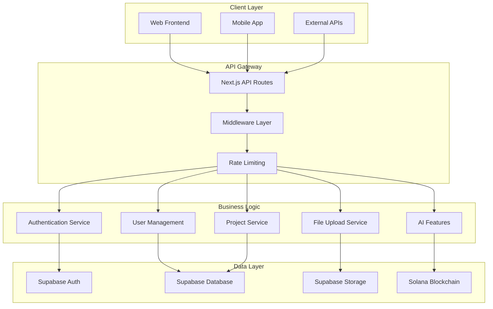

# Backend Architecture

## Overview

The ForSure backend is built on Next.js API routes with a serverless architecture, leveraging Supabase for database, authentication, and storage services. The design emphasizes security, scalability, and type safety.

## Architecture Diagram



## API Routes Structure

### Route Organization

```
app/api/
├── auth/
│   ├── register/route.ts
│   ├── login/route.ts
│   ├── logout/route.ts
│   └── me/route.ts
├── users/
│   ├── profile/route.ts
│   ├── settings/route.ts
│   └── [id]/route.ts
├── projects/
│   ├── route.ts
│   ├── [id]/route.ts
│   └── [id]/collaborators/route.ts
├── upload/
│   └── route.ts
├── blog/
│   ├── route.ts
│   ├── [slug]/route.ts
│   └── [slug]/comments/route.ts
├── ai/
│   ├── chat/route.ts
│   └── generate/route.ts
└── health/
    └── route.ts
```

## Middleware Architecture

### Authentication Middleware

```typescript
// lib/auth-middleware.ts
import { NextRequest } from 'next/server'
import { supabase } from '@/lib/supabase'

export const withAuth = (handler: Function) => {
  return async (request: NextRequest, context: any) => {
    const token = request.headers.get('Authorization')?.replace('Bearer ', '')

    if (!token) {
      return Response.json({ error: 'Unauthorized' }, { status: 401 })
    }

    const {
      data: { user },
      error,
    } = await supabase.auth.getUser(token)

    if (error || !user) {
      return Response.json({ error: 'Invalid token' }, { status: 401 })
    }

    return handler(request, { ...context, user })
  }
}
```

### Rate Limiting Middleware

```typescript
// lib/rate-limit.ts
import { NextRequest } from 'next/server'

const rateLimitMap = new Map()

export const rateLimit = (limit: number, window: number) => {
  return (handler: Function) => {
    return async (request: NextRequest, context: any) => {
      const ip = request.ip || 'unknown'
      const now = Date.now()
      const windowStart = now - window

      const requests = rateLimitMap.get(ip) || []
      const recentRequests = requests.filter(
        (time: number) => time > windowStart
      )

      if (recentRequests.length >= limit) {
        return Response.json(
          { error: 'Rate limit exceeded' },
          {
            status: 429,
            headers: {
              'X-RateLimit-Limit': limit.toString(),
              'X-RateLimit-Remaining': '0',
              'Retry-After': Math.ceil(window / 1000).toString(),
            },
          }
        )
      }

      recentRequests.push(now)
      rateLimitMap.set(ip, recentRequests)

      return handler(request, context)
    }
  }
}
```

## Database Architecture

### Supabase Integration

```typescript
// lib/supabase.ts
import { createClient } from '@supabase/supabase-js'

const supabaseUrl = process.env.NEXT_PUBLIC_SUPABASE_URL!
const supabaseKey = process.env.SUPABASE_SERVICE_ROLE_KEY!

export const supabase = createClient(supabaseUrl, supabaseKey)
```

### Type Safety with Generated Types

```typescript
// lib/database.types.ts
export type Json =
  | string
  | number
  | boolean
  | null
  | { [key: string]: Json | undefined }
  | Json[]

export interface Database {
  public: {
    Tables: {
      users: {
        Row: {
          id: string
          email: string
          name: string
          avatar_url: string | null
          role: 'user' | 'admin'
          created_at: string
          updated_at: string
        }
        Insert: {
          id?: string
          email: string
          name: string
          avatar_url?: string | null
          role?: 'user' | 'admin'
          created_at?: string
          updated_at?: string
        }
        Update: {
          id?: string
          email?: string
          name?: string
          avatar_url?: string | null
          role?: 'user' | 'admin'
          created_at?: string
          updated_at?: string
        }
      }
      // ... other tables
    }
  }
}
```

## API Response Patterns

### Standardized Response Format

```typescript
// lib/api-utils.ts
export const apiResponse = (data: any, meta?: any) => ({
  success: true,
  data,
  meta,
})

export const apiError = (
  message: string,
  status: number = 500,
  details?: any
) => ({
  success: false,
  error: message,
  details,
})
```

### Example API Route

```typescript
// app/api/projects/route.ts
import { NextRequest } from 'next/server'
import { withAuth } from '@/lib/auth-middleware'
import { supabase } from '@/lib/supabase'
import { apiResponse, apiError } from '@/lib/api-utils'
import { z } from 'zod'

const createProjectSchema = z.object({
  name: z.string().min(3).max(100),
  description: z.string().max(500).optional(),
  tech_stack: z.array(z.string()).max(10).optional(),
  tags: z.array(z.string()).max(5).optional(),
  visibility: z.enum(['public', 'private', 'unlisted']).default('private'),
})

export const GET = withAuth(async (request: NextRequest, { user }) => {
  try {
    const { searchParams } = new URL(request.url)
    const page = parseInt(searchParams.get('page') || '1')
    const limit = Math.min(parseInt(searchParams.get('limit') || '10'), 50)
    const offset = (page - 1) * limit

    const { data, error, count } = await supabase
      .from('projects')
      .select(
        `
        *,
        profiles(name, avatar_url)
      `,
        { count: 'exact' }
      )
      .eq('owner_id', user.id)
      .range(offset, offset + limit - 1)
      .order('created_at', { ascending: false })

    if (error) throw error

    return apiResponse({
      projects: data,
      pagination: {
        page,
        limit,
        total: count || 0,
        totalPages: Math.ceil((count || 0) / limit),
      },
    })
  } catch (error) {
    console.error('Projects fetch error:', error)
    return apiError('Failed to fetch projects', 500)
  }
})

export const POST = withAuth(async (request: NextRequest, { user }) => {
  try {
    const body = await request.json()
    const validatedData = createProjectSchema.parse(body)

    const { data, error } = await supabase
      .from('projects')
      .insert({
        ...validatedData,
        owner_id: user.id,
        slug: generateSlug(validatedData.name),
        status: 'active',
        progress: 0,
      })
      .select()
      .single()

    if (error) throw error

    return apiResponse(data, 201)
  } catch (error) {
    if (error instanceof z.ZodError) {
      return apiError('Validation failed', 422, error.errors)
    }

    console.error('Project creation error:', error)
    return apiError('Failed to create project', 500)
  }
})
```

## Security Architecture

### Input Validation

```typescript
// lib/validations.ts
import { z } from 'zod'

export const userRegistrationSchema = z.object({
  email: z.string().email('Invalid email format'),
  password: z
    .string()
    .min(8, 'Password must be at least 8 characters')
    .regex(
      /^(?=.*[a-z])(?=.*[A-Z])(?=.*\d)/,
      'Password must contain uppercase, lowercase, and number'
    ),
  name: z.string().min(2).max(50),
})

export const projectUpdateSchema = z.object({
  name: z.string().min(3).max(100).optional(),
  description: z.string().max(500).optional(),
  status: z.enum(['active', 'completed', 'archived']).optional(),
  progress: z.number().min(0).max(100).optional(),
})
```

### CORS Configuration

```typescript
// lib/cors.ts
export const corsHeaders = {
  'Access-Control-Allow-Origin':
    process.env.NODE_ENV === 'production' ? 'https://yourdomain.com' : '*',
  'Access-Control-Allow-Methods': 'GET, POST, PUT, DELETE, OPTIONS',
  'Access-Control-Allow-Headers': 'Content-Type, Authorization',
  'Access-Control-Max-Age': '86400',
}

export const corsMiddleware = (handler: Function) => {
  return async (request: Request) => {
    if (request.method === 'OPTIONS') {
      return new Response(null, { headers: corsHeaders })
    }

    const response = await handler(request)

    Object.entries(corsHeaders).forEach(([key, value]) => {
      response.headers.set(key, value)
    })

    return response
  }
}
```

## File Upload Architecture

### Secure File Handling

```typescript
// app/api/upload/route.ts
import { NextRequest } from 'next/server'
import { withAuth } from '@/lib/auth-middleware'
import { supabase } from '@/lib/supabase'

export const POST = withAuth(async (request: NextRequest, { user }) => {
  try {
    const formData = await request.formData()
    const file = formData.get('file') as File
    const bucket = (formData.get('bucket') as string) || 'uploads'

    // Validate file
    if (!file) {
      return apiError('No file provided', 400)
    }

    // File size limit (5MB)
    if (file.size > 5 * 1024 * 1024) {
      return apiError('File too large', 400)
    }

    // Allowed file types
    const allowedTypes = [
      'image/jpeg',
      'image/png',
      'image/gif',
      'application/pdf',
    ]
    if (!allowedTypes.includes(file.type)) {
      return apiError('File type not allowed', 400)
    }

    // Generate unique filename
    const fileExt = file.name.split('.').pop()
    const fileName = `${user.id}/${Date.now()}.${fileExt}`

    // Upload to Supabase Storage
    const { data, error } = await supabase.storage
      .from(bucket)
      .upload(fileName, file, {
        contentType: file.type,
        upsert: false,
      })

    if (error) throw error

    // Get public URL
    const {
      data: { publicUrl },
    } = supabase.storage.from(bucket).getPublicUrl(fileName)

    return apiResponse({
      id: data.id,
      filename: data.path,
      original_filename: file.name,
      file_size: file.size,
      mime_type: file.type,
      file_url: publicUrl,
      created_at: new Date().toISOString(),
    })
  } catch (error) {
    console.error('Upload error:', error)
    return apiError('Upload failed', 500)
  }
})
```

## Error Handling & Logging

### Structured Logging

```typescript
// lib/logger.ts
export const logger = {
  info: (message: string, meta?: any) => {
    console.log(
      JSON.stringify({
        level: 'info',
        message,
        meta,
        timestamp: new Date().toISOString(),
      })
    )
  },

  error: (message: string, error?: Error, meta?: any) => {
    console.error(
      JSON.stringify({
        level: 'error',
        message,
        error: error?.stack,
        meta,
        timestamp: new Date().toISOString(),
      })
    )
  },
}
```

### Global Error Handler

```typescript
// app/api/[...route]/error.ts
import { NextResponse } from 'next/server'

export const errorHandler = (error: Error) => {
  logger.error('API Error', error)

  if (error instanceof z.ZodError) {
    return NextResponse.json(
      { success: false, error: 'Validation failed', details: error.errors },
      { status: 422 }
    )
  }

  return NextResponse.json(
    { success: false, error: 'Internal server error' },
    { status: 500 }
  )
}
```

## Performance Optimization

### Database Query Optimization

```typescript
// Optimized queries with proper indexing
const getProjectsWithRelations = async (userId: string) => {
  return await supabase
    .from('projects')
    .select(
      `
      id,
      name,
      description,
      created_at,
      profiles!projects_owner_id_fkey (
        name,
        avatar_url
      ),
      project_tags (
        tags (name)
      )
    `
    )
    .eq('owner_id', userId)
    .order('created_at', { ascending: false })
}
```

### Response Caching

```typescript
// Cache headers for static data
export const cacheHeaders = {
  'Cache-Control': 'public, s-maxage=3600, stale-while-revalidate=60',
  'CDN-Cache-Control': 'public, s-maxage=3600',
}

export const withCache = (handler: Function, maxAge: number = 3600) => {
  return async (...args: any[]) => {
    const response = await handler(...args)

    response.headers.set('Cache-Control', `public, s-maxage=${maxAge}`)

    return response
  }
}
```

## Monitoring & Health Checks

### Health Check Endpoint

```typescript
// app/api/health/route.ts
export const GET = async () => {
  try {
    // Check database connection
    const { error } = await supabase.from('users').select('count').limit(1)

    const health = {
      status: 'ok',
      timestamp: new Date().toISOString(),
      services: {
        database: error ? 'error' : 'ok',
        storage: 'ok', // Supabase Storage check
        auth: 'ok', // Supabase Auth check
      },
    }

    return Response.json(health, {
      status: error ? 503 : 200,
    })
  } catch (error) {
    return Response.json(
      {
        status: 'error',
        timestamp: new Date().toISOString(),
        error: 'Health check failed',
      },
      { status: 503 }
    )
  }
}
```
