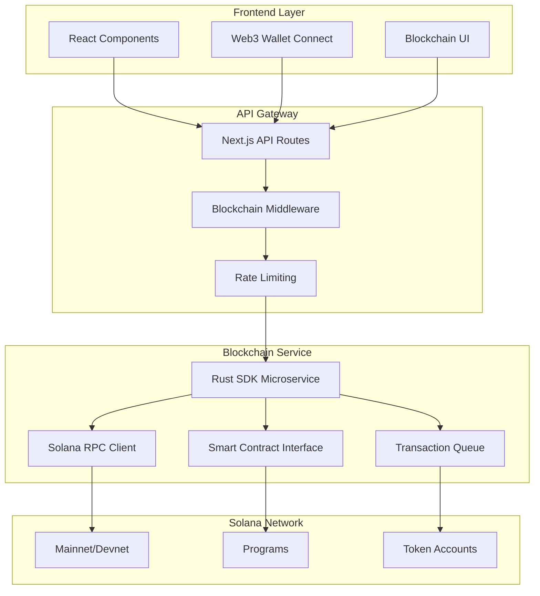

# Blockchain Integration Architecture

## Overview

ForSure integrates with the Solana blockchain to provide decentralized features including digital asset management, smart contract interactions, and Web3 capabilities. The blockchain integration is designed as a separate microservice architecture to ensure security, scalability, and maintainability.

## Architecture Diagram



## Technology Stack

### Blockchain Layer

- **Blockchain**: Solana (Mainnet/Devnet/Testnet)
- **Programming Language**: Rust for smart contracts and SDK
- **RPC Client**: Solana Web3.js
- **Wallet Integration**: Phantom, Solflare, Backpack

### Service Layer

- **Microservice**: Rust-based blockchain service
- **API**: REST/gRPC/WebSocket interfaces
- **Message Queue**: Redis for transaction processing
- **Database**: PostgreSQL for blockchain state tracking

### Integration Layer

- **Authentication**: JWT-based service authentication
- **Rate Limiting**: Prevent blockchain spam
- **Error Handling**: Comprehensive error recovery
- **Monitoring**: Transaction status and health checks

## Smart Contract Architecture

### Program Structure

```rust
// lib.rs - Main program entry point
use anchor_lang::prelude::*;

declare_id!("YourProgramID");

#[program]
pub mod forsure_blockchain {
    use super::*;

    pub fn initialize_project(
        ctx: Context<InitializeProject>,
        project_id: String,
        metadata: ProjectMetadata
    ) -> Result<()> {
        // Initialize project on-chain
    }

    pub fn update_project_status(
        ctx: Context<UpdateProjectStatus>,
        new_status: ProjectStatus
    ) -> Result<()> {
        // Update project status
    }

    pub fn mint_project_nft(
        ctx: Context<MintProjectNFT>,
        nft_metadata: NFTMetadata
    ) -> Result<()> {
        // Mint NFT for project completion
    }
}
```

### Data Structures

```rust
#[derive(Accounts)]
pub struct InitializeProject<'info> {
    #[account(init, payer = authority, space = 8 + Project::LEN)]
    pub project: Account<'info, Project>,
    #[account(mut)]
    pub authority: Signer<'info>,
    pub system_program: Program<'info, System>,
}

#[account]
pub struct Project {
    pub id: String,
    pub authority: Pubkey,
    pub status: ProjectStatus,
    pub metadata: ProjectMetadata,
    pub created_at: i64,
    pub updated_at: i64,
}

#[derive(AnchorSerialize, AnchorDeserialize, Clone)]
pub struct ProjectMetadata {
    pub name: String,
    pub description: String,
    pub tech_stack: Vec<String>,
    pub tags: Vec<String>,
}

#[derive(AnchorSerialize, AnchorDeserialize, Clone)]
pub enum ProjectStatus {
    Active,
    Completed,
    Archived,
}
```

## Rust SDK Microservice

### Service Architecture

```rust
// main.rs
use axum::{
    extract::{Path, State},
    http::StatusCode,
    response::Json,
    routing::{get, post},
    Router,
};
use solana_sdk::pubkey::Pubkey;
use std::sync::Arc;

#[derive(Clone)]
struct AppState {
    solana_client: Arc<RpcClient>,
    program_id: Pubkey,
}

#[tokio::main]
async fn main() {
    let solana_client = Arc::new(RpcClient::new(
        "https://api.devnet.solana.com".to_string()
    ));

    let program_id = Pubkey::from_str("YourProgramID").unwrap();

    let state = AppState {
        solana_client,
        program_id,
    };

    let app = Router::new()
        .route("/health", get(health_check))
        .route("/project/:id", get(get_project))
        .route("/project", post(create_project))
        .route("/project/:id/status", post(update_project_status))
        .route("/wallet/:pubkey/balance", get(get_wallet_balance))
        .with_state(state);

    let listener = tokio::net::TcpListener::bind("0.0.0.0:8080")
        .await
        .unwrap();

    println!("Blockchain service listening on {}", listener.local_addr().unwrap());
    axum::serve(listener, app).await.unwrap();
}
```

### API Endpoints

```rust
use serde::{Deserialize, Serialize};

#[derive(Serialize)]
struct ProjectResponse {
    id: String,
    authority: String,
    status: String,
    metadata: ProjectMetadata,
    created_at: i64,
    updated_at: i64,
}

#[derive(Deserialize)]
struct CreateProjectRequest {
    id: String,
    authority: String,
    metadata: ProjectMetadata,
}

async fn get_project(
    State(state): State<AppState>,
    Path(project_id): Path<String>
) -> Result<Json<ProjectResponse>, StatusCode> {
    // Fetch project from blockchain
    let project_pubkey = derive_project_pda(&project_id, &state.program_id);

    match state.solana_client.get_account(&project_pubkey) {
        Ok(account) => {
            let project = Project::try_deserialize(&mut account.data.as_slice())
                .map_err(|_| StatusCode::INTERNAL_SERVER_ERROR)?;

            Ok(Json(ProjectResponse {
                id: project.id,
                authority: project.authority.to_string(),
                status: format!("{:?}", project.status),
                metadata: project.metadata,
                created_at: project.created_at,
                updated_at: project.updated_at,
            }))
        }
        Err(_) => Err(StatusCode::NOT_FOUND),
    }
}

async fn create_project(
    State(state): State<AppState>,
    Json(request): Json<CreateProjectRequest>
) -> Result<Json<ProjectResponse>, StatusCode> {
    // Create transaction to initialize project
    let authority_pubkey = Pubkey::from_str(&request.authority)
        .map_err(|_| StatusCode::BAD_REQUEST)?;

    let project_pubkey = derive_project_pda(&request.id, &state.program_id);

    let instruction = initialize_project(
        state.program_id,
        project_pubkey,
        authority_pubkey,
        request.id.clone(),
        request.metadata.clone()
    );

    // Send transaction (would need signature from authority)
    // This is a simplified example

    Ok(Json(ProjectResponse {
        id: request.id,
        authority: request.authority,
        status: "Active".to_string(),
        metadata: request.metadata,
        created_at: chrono::Utc::now().timestamp(),
        updated_at: chrono::Utc::now().timestamp(),
    }))
}
```

## Frontend Integration

### Wallet Connection

```typescript
// lib/blockchain/wallet.ts
import { Connection, PublicKey, clusterApiUrl } from '@solana/web3.js'
import { PhantomWalletAdapter } from '@solana/wallet-adapter-wallets'

export class WalletManager {
  private connection: Connection
  private wallet: PhantomWalletAdapter

  constructor() {
    this.connection = new Connection(clusterApiUrl('devnet'))
    this.wallet = new PhantomWalletAdapter()
  }

  async connect(): Promise<string> {
    try {
      await this.wallet.connect()
      return this.wallet.publicKey?.toBase58() || ''
    } catch (error) {
      throw new Error('Failed to connect wallet')
    }
  }

  async disconnect(): Promise<void> {
    await this.wallet.disconnect()
  }

  async getBalance(): Promise<number> {
    if (!this.wallet.publicKey) {
      throw new Error('Wallet not connected')
    }

    const balance = await this.connection.getBalance(this.wallet.publicKey)
    return balance / 1e9 // Convert lamports to SOL
  }

  async signTransaction(transaction: any): Promise<string> {
    if (!this.wallet.publicKey) {
      throw new Error('Wallet not connected')
    }

    const signedTransaction = await this.wallet.signTransaction(transaction)
    return signedTransaction.serialize().toString('base64')
  }

  isConnected(): boolean {
    return this.wallet.connected
  }

  getPublicKey(): string | null {
    return this.wallet.publicKey?.toBase58() || null
  }
}
```

### Blockchain Context

```typescript
// contexts/BlockchainContext.tsx
interface BlockchainContextType {
  wallet: WalletManager | null
  isConnected: boolean
  publicKey: string | null
  balance: number
  connect: () => Promise<void>
  disconnect: () => Promise<void>
  createProject: (projectId: string, metadata: ProjectMetadata) => Promise<void>
  getProject: (projectId: string) => Promise<Project | null>
}

export const BlockchainProvider: React.FC<{ children: React.ReactNode }> = ({ children }) => {
  const [wallet, setWallet] = useState<WalletManager | null>(null)
  const [isConnected, setIsConnected] = useState(false)
  const [publicKey, setPublicKey] = useState<string | null>(null)
  const [balance, setBalance] = useState(0)

  useEffect(() => {
    const walletManager = new WalletManager()
    setWallet(walletManager)

    // Check if wallet is already connected
    if (walletManager.isConnected()) {
      setIsConnected(true)
      setPublicKey(walletManager.getPublicKey())
      updateBalance(walletManager)
    }
  }, [])

  const connect = async () => {
    if (!wallet) return

    try {
      const pubKey = await wallet.connect()
      setIsConnected(true)
      setPublicKey(pubKey)
      await updateBalance(wallet)
    } catch (error) {
      console.error('Failed to connect wallet:', error)
    }
  }

  const disconnect = async () => {
    if (!wallet) return

    await wallet.disconnect()
    setIsConnected(false)
    setPublicKey(null)
    setBalance(0)
  }

  const updateBalance = async (walletManager: WalletManager) => {
    try {
      const bal = await walletManager.getBalance()
      setBalance(bal)
    } catch (error) {
      console.error('Failed to get balance:', error)
    }
  }

  const createProject = async (projectId: string, metadata: ProjectMetadata) => {
    if (!wallet || !publicKey) {
      throw new Error('Wallet not connected')
    }

    try {
      const response = await fetch('/api/blockchain/project', {
        method: 'POST',
        headers: {
          'Content-Type': 'application/json',
          'Authorization': `Bearer ${await getAuthToken()}`
        },
        body: JSON.stringify({
          id: projectId,
          authority: publicKey,
          metadata
        })
      })

      if (!response.ok) {
        throw new Error('Failed to create project on blockchain')
      }

      const result = await response.json()
      return result
    } catch (error) {
      console.error('Blockchain project creation failed:', error)
      throw error
    }
  }

  const getProject = async (projectId: string): Promise<Project | null> => {
    try {
      const response = await fetch(`/api/blockchain/project/${projectId}`)

      if (!response.ok) {
        if (response.status === 404) {
          return null
        }
        throw new Error('Failed to fetch project from blockchain')
      }

      const result = await response.json()
      return result
    } catch (error) {
      console.error('Failed to get blockchain project:', error)
      return null
    }
  }

  return (
    <BlockchainContext.Provider value={{
      wallet,
      isConnected,
      publicKey,
      balance,
      connect,
      disconnect,
      createProject,
      getProject
    }}>
      {children}
    </BlockchainContext.Provider>
  )
}
```

## API Integration

### Next.js API Routes

```typescript
// app/api/blockchain/project/route.ts
import { NextRequest } from 'next/server'
import { withAuth } from '@/lib/auth-middleware'
import { apiResponse, apiError } from '@/lib/api-utils'

export const POST = withAuth(async (request: NextRequest, { user }) => {
  try {
    const body = await request.json()

    // Forward request to blockchain microservice
    const response = await fetch(
      `${process.env.BLOCKCHAIN_SERVICE_URL}/project`,
      {
        method: 'POST',
        headers: {
          'Content-Type': 'application/json',
          Authorization: `Bearer ${process.env.BLOCKCHAIN_SERVICE_KEY}`,
        },
        body: JSON.stringify({
          ...body,
          user_id: user.id,
        }),
      }
    )

    if (!response.ok) {
      throw new Error('Blockchain service error')
    }

    const result = await response.json()
    return apiResponse(result)
  } catch (error) {
    console.error('Blockchain project creation error:', error)
    return apiError('Failed to create project on blockchain', 500)
  }
})
```

### Transaction Queue

```typescript
// lib/blockchain/queue.ts
import Redis from 'ioredis'

class TransactionQueue {
  private redis: Redis

  constructor() {
    this.redis = new Redis(process.env.REDIS_URL!)
  }

  async addTransaction(transaction: BlockchainTransaction): Promise<void> {
    await this.redis.lpush('transactions', JSON.stringify(transaction))
  }

  async getNextTransaction(): Promise<BlockchainTransaction | null> {
    const result = await this.redis.rpop('transactions')
    return result ? JSON.parse(result) : null
  }

  async getQueueLength(): Promise<number> {
    return await this.redis.llen('transactions')
  }
}

interface BlockchainTransaction {
  id: string
  type: 'create_project' | 'update_status' | 'mint_nft'
  data: any
  user_id: string
  priority: 'high' | 'medium' | 'low'
  created_at: string
}
```

## Security Considerations

### Service Authentication

```typescript
// lib/blockchain/auth.ts
import jwt from 'jsonwebtoken'

export const generateServiceToken = (serviceId: string): string => {
  return jwt.sign(
    { service: serviceId, type: 'service' },
    process.env.BLOCKCHAIN_SERVICE_SECRET!,
    { expiresIn: '1h' }
  )
}

export const verifyServiceToken = (token: string): boolean => {
  try {
    const decoded = jwt.verify(token, process.env.BLOCKCHAIN_SERVICE_SECRET!)
    return decoded && typeof decoded === 'object' && decoded.type === 'service'
  } catch {
    return false
  }
}
```

### Rate Limiting

```typescript
// lib/blockchain/rate-limit.ts
export const blockchainRateLimit = rateLimit({
  // Transaction creation: 10 per minute
  '/api/blockchain/transaction': { limit: 10, window: 60 * 1000 },

  // Project queries: 100 per minute
  '/api/blockchain/project': { limit: 100, window: 60 * 1000 },

  // Wallet operations: 20 per minute
  '/api/blockchain/wallet': { limit: 20, window: 60 * 1000 },
})
```

## Monitoring & Analytics

### Transaction Monitoring

```typescript
// lib/blockchain/monitoring.ts
export class BlockchainMonitor {
  async trackTransaction(
    txId: string,
    userId: string,
    type: string
  ): Promise<void> {
    await supabase.from('blockchain_transactions').insert({
      id: txId,
      user_id: userId,
      type,
      status: 'pending',
      created_at: new Date().toISOString(),
    })
  }

  async updateTransactionStatus(
    txId: string,
    status: 'confirmed' | 'failed'
  ): Promise<void> {
    await supabase
      .from('blockchain_transactions')
      .update({
        status,
        updated_at: new Date().toISOString(),
      })
      .eq('id', txId)
  }

  async getTransactionStats(): Promise<any> {
    const { data } = await supabase
      .from('blockchain_transactions')
      .select('status, type, created_at')
      .gte(
        'created_at',
        new Date(Date.now() - 24 * 60 * 60 * 1000).toISOString()
      )

    return data
  }
}
```

### Health Checks

```typescript
// app/api/blockchain/health/route.ts
export const GET = async () => {
  try {
    // Check blockchain service health
    const serviceHealth = await fetch(
      `${process.env.BLOCKCHAIN_SERVICE_URL}/health`
    )
    const serviceStatus = await serviceHealth.json()

    // Check Solana network status
    const connection = new Connection(clusterApiUrl('devnet'))
    const slot = await connection.getSlot()

    const health = {
      status: 'ok',
      timestamp: new Date().toISOString(),
      services: {
        blockchain_service: serviceHealth.ok ? 'ok' : 'error',
        solana_network: slot ? 'ok' : 'error',
      },
      metrics: {
        current_slot: slot,
        queue_length: await getTransactionQueueLength(),
      },
    }

    return Response.json(health)
  } catch (error) {
    return Response.json(
      {
        status: 'error',
        timestamp: new Date().toISOString(),
        error: 'Health check failed',
      },
      { status: 503 }
    )
  }
}
```

## Deployment Configuration

### Docker Configuration

```dockerfile
# Dockerfile for blockchain service
FROM rust:1.70 as builder

WORKDIR /app
COPY . .
RUN cargo build --release

FROM debian:bookworm-slim
RUN apt-get update && apt-get install -y ca-certificates && rm -rf /var/lib/apt/lists/*
COPY --from=builder /app/target/release/forsure-blockchain /usr/local/bin/

EXPOSE 8080
CMD ["forsure-blockchain"]
```

### Environment Variables

```bash
# .env.blockchain
BLOCKCHAIN_SERVICE_URL=http://localhost:8080
BLOCKCHAIN_SERVICE_KEY=your-service-secret-key
SOLANA_NETWORK=devnet
SOLANA_RPC_URL=https://api.devnet.solana.com
PROGRAM_ID=YourProgramID
REDIS_URL=redis://localhost:6379
```
