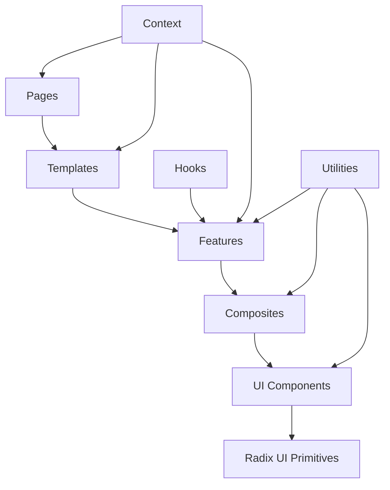

# Component Architecture

## Overview

The ForSure component architecture is built on a design system that emphasizes reusability, accessibility, and consistency. The architecture follows atomic design principles with a clear separation between UI primitives, composite components, and feature-specific components.

## Component Hierarchy



## Directory Structure

```
components/
├── ui/                    # Base UI components (atoms)
│   ├── button.tsx
│   ├── input.tsx
│   ├── card.tsx
│   ├── dialog.tsx
│   └── ...
├── forms/                 # Form components (molecules)
│   ├── auth-form.tsx
│   ├── project-form.tsx
│   └── profile-form.tsx
├── layout/                # Layout components
│   ├── header.tsx
│   ├── sidebar.tsx
│   ├── footer.tsx
│   └── navigation.tsx
├── features/              # Feature components (organisms)
│   ├── project-card.tsx
│   ├── blog-post.tsx
│   ├── user-profile.tsx
│   └── file-uploader.tsx
├── providers/             # Context providers
│   ├── auth-provider.tsx
│   ├── theme-provider.tsx
│   └── blockchain-provider.tsx
└── lib/                   # Component utilities
    ├── utils.ts
    ├── cn.ts
    └── types.ts
```

## Base UI Components (Atoms)

### Button Component

```typescript
// components/ui/button.tsx
import * as React from 'react'
import { Slot } from '@radix-ui/react-slot'
import { cva, type VariantProps } from 'class-variance-authority'
import { cn } from '@/lib/utils'

const buttonVariants = cva(
  'inline-flex items-center justify-center whitespace-nowrap rounded-md text-sm font-medium ring-offset-background transition-colors focus-visible:outline-none focus-visible:ring-2 focus-visible:ring-ring focus-visible:ring-offset-2 disabled:pointer-events-none disabled:opacity-50',
  {
    variants: {
      variant: {
        default: 'bg-primary text-primary-foreground hover:bg-primary/90',
        destructive: 'bg-destructive text-destructive-foreground hover:bg-destructive/90',
        outline: 'border border-input bg-background hover:bg-accent hover:text-accent-foreground',
        secondary: 'bg-secondary text-secondary-foreground hover:bg-secondary/80',
        ghost: 'hover:bg-accent hover:text-accent-foreground',
        link: 'text-primary underline-offset-4 hover:underline',
      },
      size: {
        default: 'h-10 px-4 py-2',
        sm: 'h-9 rounded-md px-3',
        lg: 'h-11 rounded-md px-8',
        icon: 'h-10 w-10',
      },
    },
    defaultVariants: {
      variant: 'default',
      size: 'default',
    },
  }
)

export interface ButtonProps
  extends React.ButtonHTMLAttributes<HTMLButtonElement>,
    VariantProps<typeof buttonVariants> {
  asChild?: boolean
}

const Button = React.forwardRef<HTMLButtonElement, ButtonProps>(
  ({ className, variant, size, asChild = false, ...props }, ref) => {
    const Comp = asChild ? Slot : 'button'
    return (
      <Comp
        className={cn(buttonVariants({ variant, size, className }))}
        ref={ref}
        {...props}
      />
    )
  }
)
Button.displayName = 'Button'

export { Button, buttonVariants }
```

### Input Component

```typescript
// components/ui/input.tsx
import * as React from 'react'
import { cn } from '@/lib/utils'

export interface InputProps
  extends React.InputHTMLAttributes<HTMLInputElement> {
  label?: string
  error?: string
  helperText?: string
}

const Input = React.forwardRef<HTMLInputElement, InputProps>(
  ({ className, type, label, error, helperText, id, ...props }, ref) => {
    const inputId = id || React.useId()

    return (
      <div className="space-y-2">
        {label && (
          <label
            htmlFor={inputId}
            className="text-sm font-medium leading-none peer-disabled:cursor-not-allowed peer-disabled:opacity-70"
          >
            {label}
          </label>
        )}
        <input
          type={type}
          id={inputId}
          className={cn(
            'flex h-10 w-full rounded-md border border-input bg-background px-3 py-2 text-sm ring-offset-background file:border-0 file:bg-transparent file:text-sm file:font-medium placeholder:text-muted-foreground focus-visible:outline-none focus-visible:ring-2 focus-visible:ring-ring focus-visible:ring-offset-2 disabled:cursor-not-allowed disabled:opacity-50',
            error && 'border-destructive',
            className
          )}
          ref={ref}
          {...props}
        />
        {error && (
          <p className="text-sm text-destructive">{error}</p>
        )}
        {helperText && !error && (
          <p className="text-sm text-muted-foreground">{helperText}</p>
        )}
      </div>
    )
  }
)
Input.displayName = 'Input'

export { Input }
```

### Card Component

```typescript
// components/ui/card.tsx
import * as React from 'react'
import { cn } from '@/lib/utils'

const Card = React.forwardRef<
  HTMLDivElement,
  React.HTMLAttributes<HTMLDivElement>
>(({ className, ...props }, ref) => (
  <div
    ref={ref}
    className={cn(
      'rounded-lg border bg-card text-card-foreground shadow-sm',
      className
    )}
    {...props}
  />
))
Card.displayName = 'Card'

const CardHeader = React.forwardRef<
  HTMLDivElement,
  React.HTMLAttributes<HTMLDivElement>
>(({ className, ...props }, ref) => (
  <div
    ref={ref}
    className={cn('flex flex-col space-y-1.5 p-6', className)}
    {...props}
  />
))
CardHeader.displayName = 'CardHeader'

const CardTitle = React.forwardRef<
  HTMLParagraphElement,
  React.HTMLAttributes<HTMLHeadingElement>
>(({ className, ...props }, ref) => (
  <h3
    ref={ref}
    className={cn(
      'text-2xl font-semibold leading-none tracking-tight',
      className
    )}
    {...props}
  />
))
CardTitle.displayName = 'CardTitle'

const CardDescription = React.forwardRef<
  HTMLParagraphElement,
  React.HTMLAttributes<HTMLParagraphElement>
>(({ className, ...props }, ref) => (
  <p
    ref={ref}
    className={cn('text-sm text-muted-foreground', className)}
    {...props}
  />
))
CardDescription.displayName = 'CardDescription'

const CardContent = React.forwardRef<
  HTMLDivElement,
  React.HTMLAttributes<HTMLDivElement>
>(({ className, ...props }, ref) => (
  <div ref={ref} className={cn('p-6 pt-0', className)} {...props} />
))
CardContent.displayName = 'CardContent'

const CardFooter = React.forwardRef<
  HTMLDivElement,
  React.HTMLAttributes<HTMLDivElement>
>(({ className, ...props }, ref) => (
  <div
    ref={ref}
    className={cn('flex items-center p-6 pt-0', className)}
    {...props}
  />
))
CardFooter.displayName = 'CardFooter'

export { Card, CardHeader, CardFooter, CardTitle, CardDescription, CardContent }
```

## Form Components (Molecules)

### Auth Form Component

```typescript
// components/forms/auth-form.tsx
'use client'

import { useState } from 'react'
import { useForm } from 'react-hook-form'
import { zodResolver } from '@hookform/resolvers/zod'
import { z } from 'zod'
import { Button } from '@/components/ui/button'
import { Input } from '@/components/ui/input'
import { Card, CardContent, CardDescription, CardHeader, CardTitle } from '@/components/ui/card'
import { useAuth } from '@/contexts/auth-context'

const loginSchema = z.object({
  email: z.string().email('Invalid email address'),
  password: z.string().min(6, 'Password must be at least 6 characters'),
})

type LoginFormData = z.infer<typeof loginSchema>

interface AuthFormProps {
  mode: 'login' | 'register'
  onSuccess?: () => void
}

export function AuthForm({ mode, onSuccess }: AuthFormProps) {
  const [loading, setLoading] = useState(false)
  const { login, register } = useAuth()

  const form = useForm<LoginFormData>({
    resolver: zodResolver(loginSchema),
    defaultValues: {
      email: '',
      password: '',
    },
  })

  const onSubmit = async (data: LoginFormData) => {
    setLoading(true)

    try {
      if (mode === 'login') {
        await login(data.email, data.password)
      } else {
        await register(data.email, data.password)
      }
      onSuccess?.()
    } catch (error) {
      console.error('Authentication error:', error)
    } finally {
      setLoading(false)
    }
  }

  return (
    <Card className="w-full max-w-md mx-auto">
      <CardHeader>
        <CardTitle>{mode === 'login' ? 'Sign In' : 'Create Account'}</CardTitle>
        <CardDescription>
          {mode === 'login'
            ? 'Enter your credentials to access your account'
            : 'Create a new account to get started'
          }
        </CardDescription>
      </CardHeader>
      <CardContent>
        <form onSubmit={form.handleSubmit(onSubmit)} className="space-y-4">
          <Input
            label="Email"
            type="email"
            placeholder="Enter your email"
            {...form.register('email')}
            error={form.formState.errors.email?.message}
          />

          <Input
            label="Password"
            type="password"
            placeholder="Enter your password"
            {...form.register('password')}
            error={form.formState.errors.password?.message}
          />

          <Button type="submit" className="w-full" disabled={loading}>
            {loading ? 'Please wait...' : mode === 'login' ? 'Sign In' : 'Create Account'}
          </Button>
        </form>
      </CardContent>
    </Card>
  )
}
```

## Feature Components (Organisms)

### Project Card Component

```typescript
// components/features/project-card.tsx
'use client'

import Link from 'next/link'
import { Card, CardContent, CardDescription, CardHeader, CardTitle } from '@/components/ui/card'
import { Badge } from '@/components/ui/badge'
import { Progress } from '@/components/ui/progress'
import { Avatar, AvatarFallback, AvatarImage } from '@/components/ui/avatar'
import { Button } from '@/components/ui/button'
import { Project } from '@/types'
import { formatDistanceToNow } from 'date-fns'

interface ProjectCardProps {
  project: Project
  showActions?: boolean
  onEdit?: () => void
  onDelete?: () => void
}

export function ProjectCard({
  project,
  showActions = false,
  onEdit,
  onDelete
}: ProjectCardProps) {
  const getStatusColor = (status: string) => {
    switch (status) {
      case 'active': return 'bg-green-100 text-green-800'
      case 'completed': return 'bg-blue-100 text-blue-800'
      case 'archived': return 'bg-gray-100 text-gray-800'
      default: return 'bg-gray-100 text-gray-800'
    }
  }

  return (
    <Card className="hover:shadow-lg transition-shadow">
      <CardHeader>
        <div className="flex items-start justify-between">
          <div className="flex-1">
            <CardTitle className="text-lg">
              <Link
                href={`/projects/${project.id}`}
                className="hover:text-primary transition-colors"
              >
                {project.name}
              </Link>
            </CardTitle>
            <CardDescription className="mt-1">
              {project.description}
            </CardDescription>
          </div>
          <Badge className={getStatusColor(project.status)}>
            {project.status}
          </Badge>
        </div>
      </CardHeader>

      <CardContent className="space-y-4">
        {project.tech_stack && project.tech_stack.length > 0 && (
          <div className="flex flex-wrap gap-1">
            {project.tech_stack.slice(0, 3).map((tech, index) => (
              <Badge key={index} variant="outline" className="text-xs">
                {tech}
              </Badge>
            ))}
            {project.tech_stack.length > 3 && (
              <Badge variant="outline" className="text-xs">
                +{project.tech_stack.length - 3} more
              </Badge>
            )}
          </div>
        )}

        <div className="space-y-2">
          <div className="flex justify-between text-sm">
            <span>Progress</span>
            <span>{project.progress}%</span>
          </div>
          <Progress value={project.progress} className="h-2" />
        </div>

        <div className="flex items-center justify-between text-sm text-muted-foreground">
          <div className="flex items-center gap-2">
            <Avatar className="h-6 w-6">
              <AvatarImage src={project.owner.avatar_url} />
              <AvatarFallback>
                {project.owner.name.charAt(0).toUpperCase()}
              </AvatarFallback>
            </Avatar>
            <span>{project.owner.name}</span>
          </div>
          <span>
            {formatDistanceToNow(new Date(project.created_at), { addSuffix: true })}
          </span>
        </div>

        {showActions && (
          <div className="flex gap-2 pt-2">
            <Button variant="outline" size="sm" onClick={onEdit}>
              Edit
            </Button>
            <Button variant="destructive" size="sm" onClick={onDelete}>
              Delete
            </Button>
          </div>
        )}
      </CardContent>
    </Card>
  )
}
```

## Layout Components

### Header Component

```typescript
// components/layout/header.tsx
'use client'

import { useState } from 'react'
import Link from 'next/link'
import { Button } from '@/components/ui/button'
import { Avatar, AvatarFallback, AvatarImage } from '@/components/ui/avatar'
import { DropdownMenu, DropdownMenuContent, DropdownMenuItem, DropdownMenuTrigger } from '@/components/ui/dropdown-menu'
import { useAuth } from '@/contexts/auth-context'
import { ThemeToggle } from '@/components/ui/theme-toggle'
import { Menu, X } from 'lucide-react'

export function Header() {
  const [mobileMenuOpen, setMobileMenuOpen] = useState(false)
  const { user, logout } = useAuth()

  const navigation = [
    { name: 'Projects', href: '/projects' },
    { name: 'Blog', href: '/blog' },
    { name: 'Docs', href: '/docs' },
    { name: 'Careers', href: '/careers' },
  ]

  return (
    <header className="sticky top-0 z-50 w-full border-b bg-background/95 backdrop-blur supports-[backdrop-filter]:bg-background/60">
      <div className="container flex h-16 items-center justify-between">
        <div className="flex items-center gap-6">
          <Link href="/" className="flex items-center space-x-2">
            <div className="h-8 w-8 rounded-lg bg-primary flex items-center justify-center">
              <span className="text-primary-foreground font-bold text-sm">FS</span>
            </div>
            <span className="font-bold text-xl">ForSure</span>
          </Link>

          <nav className="hidden md:flex items-center gap-6">
            {navigation.map((item) => (
              <Link
                key={item.name}
                href={item.href}
                className="text-sm font-medium hover:text-primary transition-colors"
              >
                {item.name}
              </Link>
            ))}
          </nav>
        </div>

        <div className="flex items-center gap-4">
          <ThemeToggle />

          {user ? (
            <DropdownMenu>
              <DropdownMenuTrigger asChild>
                <Button variant="ghost" className="relative h-8 w-8 rounded-full">
                  <Avatar className="h-8 w-8">
                    <AvatarImage src={user.avatar_url} alt={user.name} />
                    <AvatarFallback>
                      {user.name.charAt(0).toUpperCase()}
                    </AvatarFallback>
                  </Avatar>
                </Button>
              </DropdownMenuTrigger>
              <DropdownMenuContent className="w-56" align="end" forceMount>
                <DropdownMenuItem asChild>
                  <Link href="/account/profile">Profile</Link>
                </DropdownMenuItem>
                <DropdownMenuItem asChild>
                  <Link href="/account/settings">Settings</Link>
                </DropdownMenuItem>
                <DropdownMenuItem onClick={logout}>
                  Log out
                </DropdownMenuItem>
              </DropdownMenuContent>
            </DropdownMenu>
          ) : (
            <div className="hidden md:flex items-center gap-2">
              <Button variant="ghost" asChild>
                <Link href="/login">Sign In</Link>
              </Button>
              <Button asChild>
                <Link href="/register">Get Started</Link>
              </Button>
            </div>
          )}

          <Button
            variant="ghost"
            size="icon"
            className="md:hidden"
            onClick={() => setMobileMenuOpen(!mobileMenuOpen)}
          >
            {mobileMenuOpen ? (
              <X className="h-5 w-5" />
            ) : (
              <Menu className="h-5 w-5" />
            )}
          </Button>
        </div>
      </div>

      {/* Mobile menu */}
      {mobileMenuOpen && (
        <div className="md:hidden border-t bg-background">
          <div className="container py-4 space-y-2">
            {navigation.map((item) => (
              <Link
                key={item.name}
                href={item.href}
                className="block px-3 py-2 text-sm font-medium hover:bg-accent rounded-md"
                onClick={() => setMobileMenuOpen(false)}
              >
                {item.name}
              </Link>
            ))}

            {!user && (
              <div className="pt-4 space-y-2">
                <Button variant="ghost" className="w-full justify-start" asChild>
                  <Link href="/login">Sign In</Link>
                </Button>
                <Button className="w-full" asChild>
                  <Link href="/register">Get Started</Link>
                </Button>
              </div>
            )}
          </div>
        </div>
      )}
    </header>
  )
}
```

## Custom Hooks

### useLocalStorage Hook

```typescript
// hooks/use-local-storage.ts
import { useState, useEffect } from 'react'

export function useLocalStorage<T>(key: string, initialValue: T) {
  const [storedValue, setStoredValue] = useState<T>(() => {
    if (typeof window === 'undefined') {
      return initialValue
    }

    try {
      const item = window.localStorage.getItem(key)
      return item ? JSON.parse(item) : initialValue
    } catch (error) {
      console.error(`Error reading localStorage key "${key}":`, error)
      return initialValue
    }
  })

  const setValue = (value: T | ((val: T) => T)) => {
    try {
      const valueToStore =
        value instanceof Function ? value(storedValue) : value
      setStoredValue(valueToStore)

      if (typeof window !== 'undefined') {
        window.localStorage.setItem(key, JSON.stringify(valueToStore))
      }
    } catch (error) {
      console.error(`Error setting localStorage key "${key}":`, error)
    }
  }

  return [storedValue, setValue] as const
}
```

### useDebounce Hook

```typescript
// hooks/use-debounce.ts
import { useState, useEffect } from 'react'

export function useDebounce<T>(value: T, delay: number): T {
  const [debouncedValue, setDebouncedValue] = useState<T>(value)

  useEffect(() => {
    const handler = setTimeout(() => {
      setDebouncedValue(value)
    }, delay)

    return () => {
      clearTimeout(handler)
    }
  }, [value, delay])

  return debouncedValue
}
```

## Component Testing

### Button Component Test

```typescript
// __tests__/components/ui/button.test.tsx
import { render, screen, fireEvent } from '@testing-library/react'
import { Button } from '@/components/ui/button'

describe('Button', () => {
  it('renders with default props', () => {
    render(<Button>Click me</Button>)
    const button = screen.getByRole('button', { name: 'Click me' })
    expect(button).toBeInTheDocument()
    expect(button).toHaveClass('bg-primary')
  })

  it('renders with different variants', () => {
    render(<Button variant="destructive">Delete</Button>)
    const button = screen.getByRole('button', { name: 'Delete' })
    expect(button).toHaveClass('bg-destructive')
  })

  it('handles click events', () => {
    const handleClick = jest.fn()
    render(<Button onClick={handleClick}>Click me</Button>)

    fireEvent.click(screen.getByRole('button', { name: 'Click me' }))
    expect(handleClick).toHaveBeenCalledTimes(1)
  })

  it('is disabled when loading', () => {
    render(<Button disabled>Loading...</Button>)
    const button = screen.getByRole('button', { name: 'Loading...' })
    expect(button).toBeDisabled()
  })
})
```

## Component Patterns

### Compound Components

```typescript
// components/ui/tabs.tsx
import * as React from 'react'
import * as TabsPrimitive from '@radix-ui/react-tabs'

const Tabs = TabsPrimitive.Root
const TabsList = React.forwardRef<
  React.ElementRef<typeof TabsPrimitive.List>,
  React.ComponentPropsWithoutRef<typeof TabsPrimitive.List>
>(({ className, ...props }, ref) => (
  <TabsPrimitive.List
    ref={ref}
    className={cn(
      'inline-flex h-10 items-center justify-center rounded-md bg-muted p-1 text-muted-foreground',
      className
    )}
    {...props}
  />
))
TabsList.displayName = TabsPrimitive.List.displayName

const TabsTrigger = React.forwardRef<
  React.ElementRef<typeof TabsPrimitive.Trigger>,
  React.ComponentPropsWithoutRef<typeof TabsPrimitive.Trigger>
>(({ className, ...props }, ref) => (
  <TabsPrimitive.Trigger
    ref={ref}
    className={cn(
      'inline-flex items-center justify-center whitespace-nowrap rounded-sm px-3 py-1.5 text-sm font-medium ring-offset-background transition-all focus-visible:outline-none focus-visible:ring-2 focus-visible:ring-ring focus-visible:ring-offset-2 disabled:pointer-events-none disabled:opacity-50 data-[state=active]:bg-background data-[state=active]:text-foreground data-[state=active]:shadow-sm',
      className
    )}
    {...props}
  />
))
TabsTrigger.displayName = TabsPrimitive.Trigger.displayName

const TabsContent = React.forwardRef<
  React.ElementRef<typeof TabsPrimitive.Content>,
  React.ComponentPropsWithoutRef<typeof TabsPrimitive.Content>
>(({ className, ...props }, ref) => (
  <TabsPrimitive.Content
    ref={ref}
    className={cn(
      'mt-2 ring-offset-background focus-visible:outline-none focus-visible:ring-2 focus-visible:ring-ring focus-visible:ring-offset-2',
      className
    )}
    {...props}
  />
))
TabsContent.displayName = TabsPrimitive.Content.displayName

export { Tabs, TabsList, TabsTrigger, TabsContent }
```

### Render Props Pattern

```typescript
// components/ui/data-provider.tsx
interface DataProviderProps<T> {
  url: string
  children: (data: { data: T | null; loading: boolean; error: string | null }) => React.ReactNode
}

export function DataProvider<T>({ url, children }: DataProviderProps<T>) {
  const [data, setData] = useState<T | null>(null)
  const [loading, setLoading] = useState(true)
  const [error, setError] = useState<string | null>(null)

  useEffect(() => {
    fetchData()
  }, [url])

  const fetchData = async () => {
    try {
      setLoading(true)
      const response = await fetch(url)
      const result = await response.json()
      setData(result)
    } catch (err) {
      setError(err instanceof Error ? err.message : 'An error occurred')
    } finally {
      setLoading(false)
    }
  }

  return <>{children({ data, loading, error })}</>
}
```

## Performance Optimization

### Memoization

```typescript
// components/features/expensive-component.tsx
import { memo, useMemo } from 'react'

interface ExpensiveComponentProps {
  data: number[]
  filter: string
}

export const ExpensiveComponent = memo<ExpensiveComponentProps>(({ data, filter }) => {
  const filteredData = useMemo(() => {
    return data.filter(item => item.toString().includes(filter))
  }, [data, filter])

  const processedData = useMemo(() => {
    return filteredData.map(item => ({
      value: item,
      squared: item * item,
      cubed: item * item * item
    }))
  }, [filteredData])

  return (
    <div>
      {processedData.map((item, index) => (
        <div key={index}>
          {item.value}² = {item.squared}, {item.value}³ = {item.cubed}
        </div>
      ))}
    </div>
  )
})
```

### Code Splitting

```typescript
// components/features/heavy-component.tsx
import { lazy, Suspense } from 'react'

const HeavyComponent = lazy(() => import('./heavy-component-impl'))

export function LazyHeavyComponent() {
  return (
    <Suspense fallback={<div>Loading...</div>}>
      <HeavyComponent />
    </Suspense>
  )
}
```
