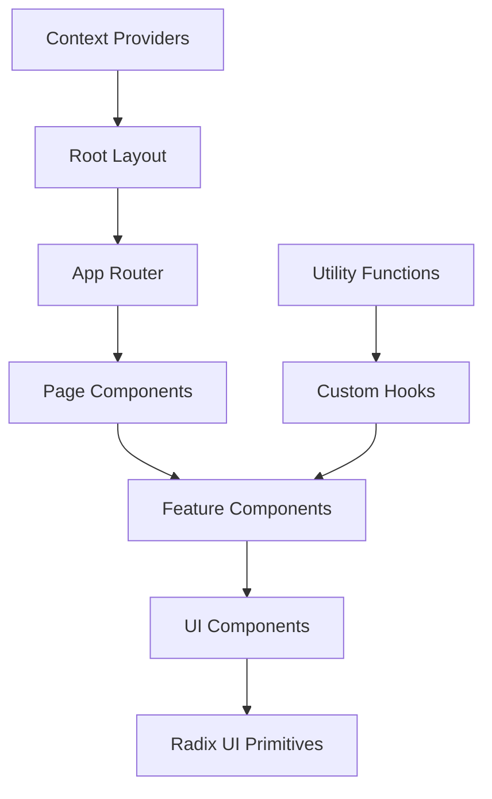

# Frontend Architecture

## Overview

The ForSure frontend is built with Next.js 15 and React 19, utilizing the App Router for modern routing and server-side rendering capabilities. The architecture emphasizes type safety, performance, and developer experience.

## Directory Structure

```
app/
├── (pages)/              # Route groups for organization
│   ├── about/            # About page
│   ├── blog/             # Blog system
│   ├── careers/          # Career pages
│   ├── docs/             # Documentation
│   └── projects/         # Project management
├── api/                  # API routes (backend)
├── globals.css           # Global styles
├── layout.tsx            # Root layout component
├── page.tsx              # Home page
└── loading.tsx           # Global loading component
```

## Component Architecture

### Component Hierarchy



### Component Categories

#### 1. **UI Components** (`/components/ui/`)

Base components built on Radix UI primitives:

- Form controls (Input, Select, Checkbox)
- Navigation (Dropdown, Menu, Tabs)
- Feedback (Toast, Alert, Progress)
- Layout (Card, Separator, ScrollArea)

#### 2. **Feature Components** (`/components/`)

Business logic components:

- Authentication forms and flows
- Project management interfaces
- Blog post components
- File upload components

#### 3. **Layout Components**

- Header and navigation
- Sidebar and footer
- Page layouts and templates

## State Management

### React Context API

Primary state management solution using React's built-in Context:

```typescript
// Auth Context
const AuthContext = createContext<AuthContextType>({
  user: null,
  loading: true,
  login: async () => {},
  logout: async () => {},
  register: async () => {},
})

// Theme Context
const ThemeContext = createContext<ThemeContextType>({
  theme: 'system',
  setTheme: () => {},
})
```

### Local State

- Component state with `useState`
- Complex state with `useReducer`
- Server state with React Query (if needed)

## Routing Architecture

### Next.js App Router

Utilizes the new App Router for:

- Server-side rendering (SSR)
- Static site generation (SSG)
- Incremental static regeneration (ISR)
- API routes

### Route Groups

Organized using route groups for better structure:

- `(pages)` - Main application pages
- `(auth)` - Authentication pages
- `(admin)` - Admin-only pages

### Dynamic Routes

- `[slug]` - Dynamic blog posts and projects
- `[...catchAll]` - Catch-all routes for 404 handling

## Styling Architecture

### Tailwind CSS Integration

```typescript
// tailwind.config.ts
import type { Config } from 'tailwindcss'

const config: Config = {
  content: [
    './pages/**/*.{js,ts,jsx,tsx,mdx}',
    './components/**/*.{js,ts,jsx,tsx,mdx}',
    './app/**/*.{js,ts,jsx,tsx,mdx}',
  ],
  theme: {
    extend: {
      colors: {
        border: 'hsl(var(--border))',
        background: 'hsl(var(--background))',
        foreground: 'hsl(var(--foreground))',
      },
    },
  },
  plugins: [require('tailwindcss-animate')],
}
```

### CSS Variables

Dynamic theming using CSS custom properties:

```css
:root {
  --background: 0 0% 100%;
  --foreground: 222.2 84% 4.9%;
  --border: 214.3 31.8% 91.4%;
}

.dark {
  --background: 222.2 84% 4.9%;
  --foreground: 210 40% 98%;
  --border: 217.2 32.6% 17.5%;
}
```

## Animation Architecture

### GSAP Integration

Professional animations using GSAP:

```typescript
import { gsap } from 'gsap'
import { ScrollTrigger } from 'gsap/dist/ScrollTrigger'

gsap.registerPlugin(ScrollTrigger)

// Page transition animations
const pageTransition = {
  initial: { opacity: 0, y: 20 },
  animate: { opacity: 1, y: 0 },
  exit: { opacity: 0, y: -20 },
}
```

### Framer Motion

Component-level animations with Framer Motion:

```typescript
import { motion } from 'framer-motion'

const AnimatedComponent = () => (
  <motion.div
    initial={{ scale: 0.8, opacity: 0 }}
    animate={{ scale: 1, opacity: 1 }}
    transition={{ duration: 0.3 }}
  >
    Content
  </motion.div>
)
```

## Form Architecture

### React Hook Form + Zod

Type-safe form handling with validation:

```typescript
import { useForm } from 'react-hook-form'
import { zodResolver } from '@hookform/resolvers/zod'
import { z } from 'zod'

const formSchema = z.object({
  email: z.string().email(),
  password: z.string().min(8),
})

const LoginForm = () => {
  const form = useForm<z.infer<typeof formSchema>>({
    resolver: zodResolver(formSchema),
  })

  // Form submission logic
}
```

## Performance Optimization

### Code Splitting

- Automatic route-based code splitting
- Dynamic imports for heavy components
- Lazy loading for images and assets

### Image Optimization

```typescript
import Image from 'next/image'

<Image
  src="/hero-image.jpg"
  alt="Hero"
  width={1200}
  height={600}
  priority // Above the fold
  placeholder="blur"
/>
```

### Caching Strategy

- Static generation for marketing pages
- Incremental static regeneration for blog posts
- Client-side caching for API responses

## Accessibility Architecture

### Semantic HTML

- Proper heading hierarchy
- ARIA labels and roles
- Keyboard navigation support

### Radix UI Integration

Built-in accessibility features:

- Focus management
- Screen reader support
- Keyboard interaction patterns

## Error Handling

### Error Boundaries

```typescript
'use client'

import { ErrorBoundary } from 'react-error-boundary'

const ErrorFallback = ({ error }: { error: Error }) => (
  <div role="alert">
    <h2>Something went wrong:</h2>
    <pre>{error.message}</pre>
  </div>
)

const App = () => (
  <ErrorBoundary FallbackComponent={ErrorFallback}>
    <AppContent />
  </ErrorBoundary>
)
```

### Global Error Handling

- Custom error pages (404, 500)
- API error handling with toast notifications
- Logging and monitoring integration

## Testing Architecture

### Component Testing

```typescript
import { render, screen } from '@testing-library/react'
import { Button } from '@/components/ui/button'

test('renders button with text', () => {
  render(<Button>Click me</Button>)
  expect(screen.getByRole('button', { name: 'Click me' })).toBeInTheDocument()
})
```

### Integration Testing

- User flow testing with Playwright
- API integration testing
- Visual regression testing

## Internationalization

### Next.js i18n

```typescript
// next.config.js
module.exports = {
  i18n: {
    locales: ['en', 'es', 'fr'],
    defaultLocale: 'en',
  },
}
```

### Dynamic Content

- Locale-based routing
- Translation file management
- Date and number formatting
