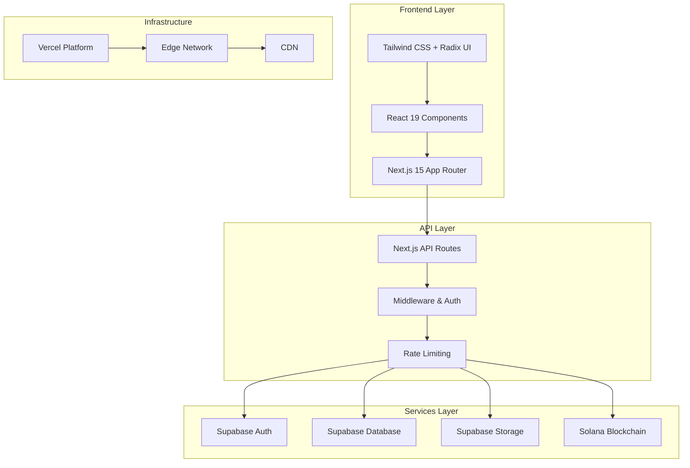
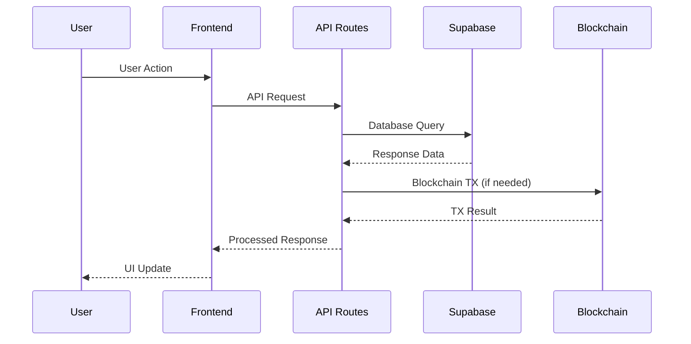

# System Architecture Overview

## High-Level Architecture

ForSure is a modern, full-stack web application built on a scalable, serverless architecture with the following key components:

## Core Design Principles

### 1. **Serverless-First**

- All backend logic runs in serverless functions
- Automatic scaling and zero maintenance
- Cost-effective with pay-per-use pricing

### 2. **Type Safety End-to-End**

- TypeScript across frontend and backend
- Database types generated from schema
- Zod validation for API contracts

### 3. **Security by Default**

- Authentication middleware on all protected routes
- Input validation and sanitization
- Row Level Security (RLS) in database

### 4. **Performance Optimized**

- Edge caching with Vercel
- Image optimization and lazy loading
- Database query optimization

## Technology Stack

### Frontend Stack

- **Next.js 15**: React framework with App Router
- **React 19**: UI library with concurrent features
- **TypeScript 5**: Type-safe JavaScript
- **Tailwind CSS**: Utility-first CSS framework
- **Radix UI**: Accessible component primitives

### Backend Stack

- **Next.js API Routes**: Serverless functions
- **Supabase**: Backend-as-a-Service platform
- **PostgreSQL**: Primary database
- **JWT**: Authentication tokens

### Infrastructure

- **Vercel**: Hosting and deployment platform
- **Edge Network**: Global CDN and edge functions
- **Supabase**: Managed database and auth

## Data Flow Architecture

## Security Architecture

### Authentication Flow

1. **User Registration**: Supabase Auth with email verification
2. **Login**: JWT tokens with secure HTTP-only cookies
3. **Session Management**: Automatic token refresh
4. **Authorization**: Role-based access control (RBAC)

### Data Protection

- **Encryption**: All data encrypted in transit and at rest
- **Input Validation**: Zod schemas for all API inputs
- **Rate Limiting**: Prevent abuse and DDoS attacks
- **CORS**: Proper cross-origin resource sharing

## Scalability Considerations

### Horizontal Scaling

- Serverless functions auto-scale based on demand
- Database connection pooling with Supabase
- CDN caching for static assets

### Performance Optimization

- **Code Splitting**: Automatic with Next.js
- **Image Optimization**: Next.js Image component
- **Database Indexing**: Optimized query performance
- **Caching Strategy**: Edge and database caching

## Deployment Architecture

### Production Environment

- **Primary**: Vercel production with custom domain
- **Database**: Supabase production project
- **Monitoring**: Vercel Analytics and error tracking

### Development Workflow

- **Local Development**: Docker containers for consistency
- **Staging**: Preview deployments for PR testing
- **CI/CD**: Automated testing and deployment

## Monitoring & Observability

### Application Monitoring

- **Performance**: Vercel Analytics
- **Errors**: Custom error tracking
- **Logs**: Structured logging with correlation IDs

### Business Metrics

- **User Analytics**: Custom tracking
- **API Usage**: Rate limiting and usage metrics
- **Database Performance**: Query optimization monitoring
