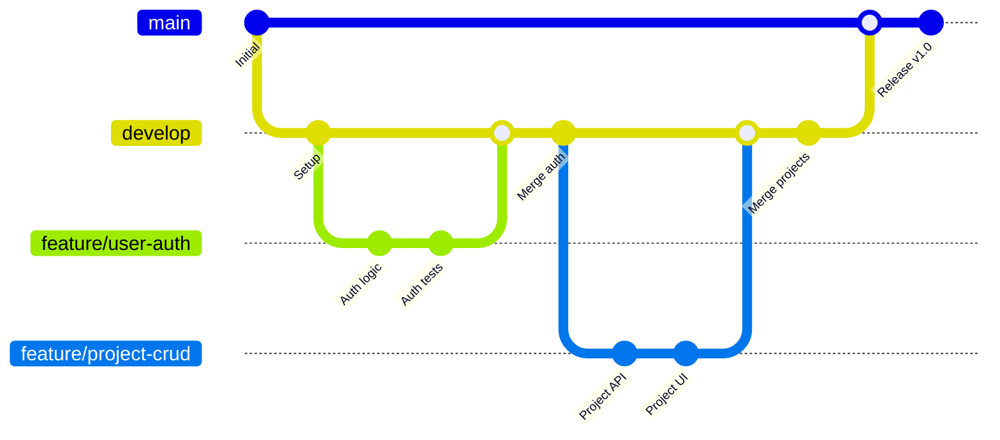

# Development Workflow Guide

This guide covers the development workflow, coding standards, and best practices for contributing to the ForSure project.

## Development Workflow Overview

ForSure follows a Git-based development workflow with the following key principles:

- **Feature-based development** with isolated branches
- **Code review** through pull requests
- **Automated testing** and quality checks
- **Incremental deployment** with staging environment

## Git Workflow

### Branch Strategy



### Branch Types

#### Main Branches

- **`main`**: Production-ready code, always deployable
- **`develop`**: Integration branch for features, staging deployment

#### Feature Branches

- **`feature/feature-name`**: New features and enhancements
- **`bugfix/bug-description`**: Bug fixes and patches
- **`hotfix/critical-fix`**: Urgent production fixes

#### Release Branches

- **`release/v1.0.0`**: Preparation for releases
- **`hotfix/v1.0.1`**: Production hotfixes

### Branch Naming Conventions

```bash
# Features
feature/user-authentication
feature/project-management
feature/blog-system

# Bug fixes
bugfix/login-validation-error
bugfix/image-upload-failure

# Hotfixes
hotfix/security-vulnerability
hotfix/database-connection-issue

# Releases
release/v1.0.0
release/v1.1.0
```

### Commit Message Standards

#### Conventional Commits Format

```
<type>[optional scope]: <description>

[optional body]

[optional footer(s)]
```

#### Commit Types

- **`feat`**: New feature
- **`fix`**: Bug fix
- **`docs`**: Documentation changes
- **`style`**: Code formatting, missing semicolons
- **`refactor`**: Code refactoring without feature changes
- **`test`**: Adding or updating tests
- **`chore`**: Maintenance tasks, dependency updates

#### Examples

```bash
# Feature commit
feat(auth): add OAuth integration with Google and GitHub

# Bug fix commit
fix(upload): resolve file size validation error for images larger than 5MB

# Documentation commit
docs(api): update authentication endpoints documentation

# Refactoring commit
refactor(components): extract common button styles into shared component

# Test commit
test(user): add unit tests for user registration validation
```

### Pull Request Process

#### Creating a Pull Request

1. **Create Feature Branch**

```bash
git checkout develop
git pull origin develop
git checkout -b feature/your-feature-name
```

2. **Make Changes**

```bash
# Make your changes
git add .
git commit -m "feat(component): add new feature with proper commit message"
```

3. **Push and Create PR**

```bash
git push origin feature/your-feature-name
# Create pull request on GitHub/GitLab
```

#### Pull Request Template

```markdown
## Description

Brief description of the changes and their purpose.

## Type of Change

- [ ] Bug fix (non-breaking change that fixes an issue)
- [ ] New feature (non-breaking change that adds functionality)
- [ ] Breaking change (fix or feature that would cause existing functionality to not work as expected)
- [ ] Documentation update

## Testing

- [ ] Unit tests pass
- [ ] Integration tests pass
- [ ] Manual testing completed
- [ ] Cross-browser testing completed

## Checklist

- [ ] Code follows project style guidelines
- [ ] Self-review of the code completed
- [ ] Comments added for complex logic
- [ ] Documentation updated if necessary
- [ ] No console errors in browser
- [ ] Responsive design verified

## Screenshots

Add screenshots if this PR changes UI/UX.

## Related Issues

Closes #123
Related to #456
```

#### Code Review Guidelines

##### Reviewer Checklist

- [ ] **Functionality**: Does the code work as intended?
- [ ] **Testing**: Are there adequate tests?
- [ ] **Performance**: Any performance implications?
- [ ] **Security**: Any security concerns?
- [ ] **Documentation**: Is code properly documented?
- [ ] **Style**: Does it follow project standards?

##### Author Response Guidelines

- [ ] Address all review comments
- [ ] Update tests as needed
- [ ] Re-request review after changes
- [ ] Be responsive and respectful

## Development Environment Setup

### Local Development Setup

```bash
# Clone the repository
git clone https://github.com/elicharlese/ForSure.git
cd ForSure

# Install dependencies
pnpm install

# Set up environment
cp .env.example .env.local
# Edit .env.local with your configuration

# Start development server
pnpm dev
```

### Development Scripts

```json
{
  "scripts": {
    "dev": "next dev",
    "build": "next build",
    "start": "next start",
    "lint": "next lint",
    "lint:fix": "next lint --fix",
    "format": "prettier --write .",
    "format:check": "prettier --check .",
    "type-check": "tsc --noEmit",
    "test": "jest",
    "test:watch": "jest --watch",
    "test:coverage": "jest --coverage",
    "test:ci": "jest --ci --coverage --watchAll=false",
    "db:push": "pnpm prisma db push",
    "db:pull": "pnpm prisma db pull",
    "db:migrate": "pnpm prisma migrate dev",
    "db:studio": "pnpm prisma studio",
    "prepare": "husky install"
  }
}
```

### Pre-commit Hooks

Husky is configured to run quality checks before commits:

```bash
# .husky/pre-commit
#!/usr/sh
. "$(dirname "$0")/_/husky.sh"

pnpm lint
pnpm type-check
pnpm format:check
```

```bash
# .husky/pre-push
#!/bin/sh
. "$(dirname "$0")/_/husky.sh"

pnpm test
```

## Coding Standards

### TypeScript Guidelines

#### Type Definitions

```typescript
// Use interfaces for object shapes
interface User {
  id: string
  email: string
  name: string
  role: UserRole
  createdAt: Date
}

// Use types for unions, primitives, and utility types
type UserRole = 'user' | 'admin' | 'moderator'
type Status = 'pending' | 'active' | 'completed'

// Use generics for reusable components
interface ApiResponse<T> {
  success: boolean
  data: T
  error?: string
}
```

#### Function Signatures

```typescript
// Explicit return types
function calculateTotal(items: CartItem[]): number {
  return items.reduce((sum, item) => sum + item.price * item.quantity, 0)
}

// Async functions with proper typing
async function fetchUser(id: string): Promise<User | null> {
  const response = await fetch(`/api/users/${id}`)
  return response.json()
}
```

#### React Component Patterns

```typescript
// Functional components with props interface
interface ButtonProps {
  children: React.ReactNode
  variant?: 'primary' | 'secondary'
  size?: 'sm' | 'md' | 'lg'
  onClick?: () => void
}

export const Button: React.FC<ButtonProps> = ({
  children,
  variant = 'primary',
  size = 'md',
  onClick
}) => {
  return (
    <button
      className={`btn btn-${variant} btn-${size}`}
      onClick={onClick}
    >
      {children}
    </button>
  )
}
```

### Code Style Guidelines

#### ESLint Configuration

```json
{
  "extends": ["next/core-web-vitals", "@typescript-eslint/recommended"],
  "rules": {
    "no-console": "warn",
    "no-unused-vars": "error",
    "@typescript-eslint/no-unused-vars": "error",
    "@typescript-eslint/explicit-function-return-type": "warn",
    "prefer-const": "error",
    "no-var": "error"
  }
}
```

#### Prettier Configuration

```json
{
  "semi": true,
  "trailingComma": "es5",
  "singleQuote": true,
  "printWidth": 80,
  "tabWidth": 2,
  "useTabs": false,
  "bracketSpacing": true,
  "arrowParens": "avoid"
}
```

#### Naming Conventions

```typescript
// Variables and functions: camelCase
const userName = 'john_doe'
const getUserData = () => {}

// Constants: SCREAMING_SNAKE_CASE
const API_BASE_URL = 'https://api.forsure.app'
const MAX_FILE_SIZE = 5242880

// Classes and Components: PascalCase
class UserService {}
const UserProfile: React.FC = () => {}

// Interfaces and Types: PascalCase
interface UserData {}
type ApiResponse<T> = {}

// Files: kebab-case
// user-profile.tsx
// api-client.ts
// database-connection.ts
```

### File Organization

#### Directory Structure

```
src/
├── components/          # Reusable components
│   ├── ui/            # Base UI components
│   ├── forms/          # Form components
│   └── features/       # Feature components
├── lib/               # Utility functions
├── hooks/             # Custom React hooks
├── contexts/          # React contexts
├── types/             # TypeScript type definitions
├── constants/         # Application constants
└── utils/             # Helper functions
```

#### Component File Structure

```typescript
// components/features/UserCard.tsx
import React from 'react'
import { User } from '@/types/user'
import { Avatar } from '@/components/ui/avatar'

interface UserCardProps {
  user: User
  onEdit?: (user: User) => void
  onDelete?: (userId: string) => void
}

export const UserCard: React.FC<UserCardProps> = ({
  user,
  onEdit,
  onDelete
}) => {
  const handleEdit = () => {
    onEdit?.(user)
  }

  const handleDelete = () => {
    onDelete?.(user.id)
  }

  return (
    <div className="user-card">
      <Avatar src={user.avatarUrl} name={user.name} />
      <div className="user-info">
        <h3>{user.name}</h3>
        <p>{user.email}</p>
      </div>
      <div className="user-actions">
        <button onClick={handleEdit}>Edit</button>
        <button onClick={handleDelete}>Delete</button>
      </div>
    </div>
  )
}

export default UserCard
```

## Testing Guidelines

### Testing Strategy

#### Test Types

- **Unit Tests**: Test individual functions and components
- **Integration Tests**: Test component interactions
- **End-to-End Tests**: Test user workflows
- **API Tests**: Test API endpoints

#### Testing Framework Setup

```typescript
// jest.config.js
module.exports = {
  testEnvironment: 'jsdom',
  setupFilesAfterEnv: ['<rootDir>/jest.setup.js'],
  moduleNameMapping: {
    '^@/(.*)$': '<rootDir>/$1',
  },
  testMatch: ['**/__tests__/**/*.(ts|tsx)', '**/*.(test|spec).(ts|tsx)'],
  collectCoverageFrom: [
    '**/*.(ts|tsx)',
    '!**/*.d.ts',
    '!**/node_modules/**',
    '!**/.next/**',
  ],
  coverageThreshold: {
    global: {
      branches: 80,
      functions: 80,
      lines: 80,
      statements: 80,
    },
  },
}
```

#### Unit Testing Examples

```typescript
// __tests__/components/UserCard.test.tsx
import React from 'react'
import { render, screen, fireEvent } from '@testing-library/react'
import { UserCard } from '@/components/features/UserCard'
import { mockUser } from '@/__mocks__/user'

describe('UserCard', () => {
  const defaultProps = {
    user: mockUser
  }

  it('renders user information correctly', () => {
    render(<UserCard {...defaultProps} />)

    expect(screen.getByText(mockUser.name)).toBeInTheDocument()
    expect(screen.getByText(mockUser.email)).toBeInTheDocument()
  })

  it('calls onEdit when edit button is clicked', () => {
    const onEdit = jest.fn()
    render(<UserCard {...defaultProps} onEdit={onEdit} />)

    fireEvent.click(screen.getByText('Edit'))
    expect(onEdit).toHaveBeenCalledWith(mockUser)
  })

  it('calls onDelete when delete button is clicked', () => {
    const onDelete = jest.fn()
    render(<UserCard {...defaultProps} onDelete={onDelete} />)

    fireEvent.click(screen.getByText('Delete'))
    expect(onDelete).toHaveBeenCalledWith(mockUser.id)
  })
})
```

#### API Testing Examples

```typescript
// __tests__/api/users.test.ts
import { createMocks } from 'node-mocks-http'
import handler from '@/pages/api/users/index'

describe('/api/users', () => {
  it('returns user list on GET request', async () => {
    const { req, res } = createMocks({ method: 'GET' })

    await handler(req, res)

    expect(res._getStatusCode()).toBe(200)
    const data = JSON.parse(res._getData())
    expect(data).toHaveProperty('success', true)
    expect(data).toHaveProperty('data')
  })

  it('creates user on POST request', async () => {
    const userData = {
      name: 'John Doe',
      email: 'john@example.com',
    }

    const { req, res } = createMocks({
      method: 'POST',
      body: userData,
    })

    await handler(req, res)

    expect(res._getStatusCode()).toBe(201)
    const data = JSON.parse(res._getData())
    expect(data.success).toBe(true)
  })
})
```

## Performance Guidelines

### Code Optimization

#### React Performance

```typescript
// Use React.memo for expensive components
export const ExpensiveComponent = React.memo(({ data }) => {
  // Component logic
})

// Use useMemo for expensive calculations
const ExpensiveList = ({ items }) => {
  const sortedItems = useMemo(() => {
    return items.sort((a, b) => a.name.localeCompare(b.name))
  }, [items])

  return <List items={sortedItems} />
}

// Use useCallback for stable function references
const ParentComponent = ({ items }) => {
  const handleClick = useCallback((item) => {
    console.log('Clicked:', item)
  }, [])

  return items.map(item => (
    <ChildComponent key={item.id} item={item} onClick={handleClick} />
  ))
}
```

#### Image Optimization

```typescript
import Image from 'next/image'

// Use Next.js Image component
const OptimizedImage = ({ src, alt, ...props }) => {
  return (
    <Image
      src={src}
      alt={alt}
      width={800}
      height={600}
      placeholder="blur"
      priority={props.priority}
      {...props}
    />
  )
}
```

### Bundle Optimization

#### Dynamic Imports

```typescript
// Lazy load heavy components
const HeavyComponent = dynamic(() => import('./HeavyComponent'), {
  loading: () => <div>Loading...</div>,
  ssr: false
})

// Route-based code splitting
const AdminPanel = dynamic(() => import('@/components/AdminPanel'))
```

#### Tree Shaking

```typescript
// Import only what you need
import { Button, Input } from '@/components/ui'
// Instead of
import * as UI from '@/components/ui'
```

## Security Guidelines

### Input Validation

```typescript
// Validate all user inputs
import { z } from 'zod'

const userSchema = z.object({
  email: z.string().email('Invalid email format'),
  password: z.string().min(8, 'Password must be at least 8 characters'),
  name: z.string().min(2, 'Name must be at least 2 characters'),
})

// Validate API inputs
export const POST = async (request: NextRequest) => {
  try {
    const body = await request.json()
    const validatedData = userSchema.parse(body)

    // Process validated data
  } catch (error) {
    if (error instanceof z.ZodError) {
      return Response.json(
        {
          success: false,
          error: 'Validation failed',
          details: error.errors,
        },
        { status: 400 }
      )
    }
  }
}
```

### Authentication and Authorization

```typescript
// Protect API routes
import { withAuth } from '@/lib/auth-middleware'

export const GET = withAuth(async (request: NextRequest, { user }) => {
  // User is authenticated and available
  const userId = user.id

  // Check permissions
  if (user.role !== 'admin') {
    return Response.json(
      {
        success: false,
        error: 'Insufficient permissions',
      },
      { status: 403 }
    )
  }

  // Process request
})
```

### Environment Security

```typescript
// Never expose sensitive data
export const config = {
  apiBaseUrl: process.env.API_BASE_URL, // Safe
  secretKey: process.env.SECRET_KEY, // Safe

  // Never expose this in client-side code
  databasePassword: process.env.DB_PASSWORD, // ❌ Never do this
}
```

## Documentation Guidelines

### Code Comments

```typescript
/**
 * Calculates the total price including tax
 * @param items - Array of cart items
 * @param taxRate - Tax rate as decimal (0.1 for 10%)
 * @returns Total price including tax
 * @example
 * calculateTotal([{ price: 100, quantity: 2 }], 0.1) // Returns 220
 */
export const calculateTotal = (items: CartItem[], taxRate: number): number => {
  const subtotal = items.reduce(
    (sum, item) => sum + item.price * item.quantity,
    0
  )
  return subtotal * (1 + taxRate)
}

// Complex logic explanation
if (userRole === 'admin') {
  // Admin users can access all resources
  return true
} else if (userRole === 'moderator' && resource.isPublic) {
  // Moderators can only access public resources
  return true
} else {
  // Regular users need specific permissions
  return checkUserPermissions(user, resource)
}
```

### README Updates

When adding new features:

1. Update the main README with new capabilities
2. Add API documentation to the docs folder
3. Update environment variable examples
4. Add setup instructions for new dependencies

## Release Process

### Version Management

```bash
# Semantic versioning: MAJOR.MINOR.PATCH
# MAJOR: Breaking changes
# MINOR: New features (backward compatible)
# PATCH: Bug fixes (backward compatible)

# Examples:
# 1.0.0 → 1.0.1 (bug fix)
# 1.0.1 → 1.1.0 (new feature)
# 1.1.0 → 2.0.0 (breaking change)
```

### Release Checklist

#### Pre-Release

- [ ] All tests passing
- [ ] Code review completed
- [ ] Documentation updated
- [ ] Version number updated
- [ ] CHANGELOG.md updated

#### Release Process

```bash
# Create release branch
git checkout develop
git pull origin develop
git checkout -b release/v1.0.0

# Update version in package.json
# Update CHANGELOG.md
# Commit changes
git commit -m "chore: prepare release v1.0.0"

# Merge to main
git checkout main
git merge release/v1.0.0
git tag v1.0.0
git push origin main --tags

# Merge back to develop
git checkout develop
git merge main
git push origin develop
```

#### Post-Release

- [ ] Deploy to production
- [ ] Verify deployment
- [ ] Monitor for issues
- [ ] Announce release

## Contributing Guidelines Summary

### Before You Start

1. Read this documentation thoroughly
2. Set up your development environment
3. Understand the project architecture
4. Review existing issues and discussions

### During Development

1. Follow the Git workflow
2. Write clean, tested code
3. Use meaningful commit messages
4. Update documentation as needed

### Before Submitting

1. Run all tests and ensure they pass
2. Check code quality with linting
3. Test your changes manually
4. Update relevant documentation

### After Submission

1. Respond to code review feedback
2. Make requested changes
3. Keep the PR updated
4. Celebrate your contribution! 🎉

Thank you for contributing to ForSure! Your contributions help make this project better for everyone.
